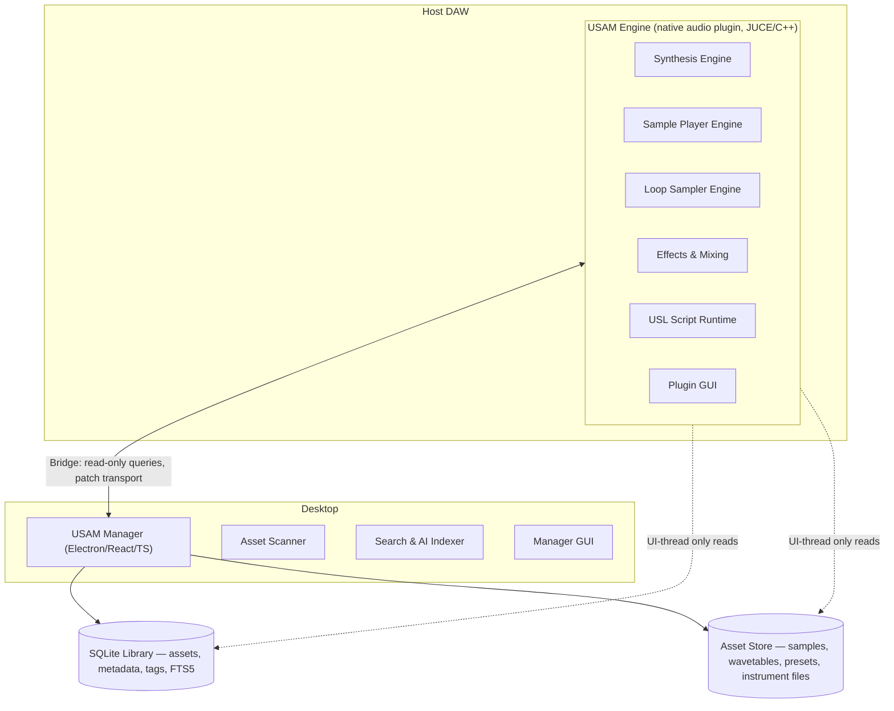
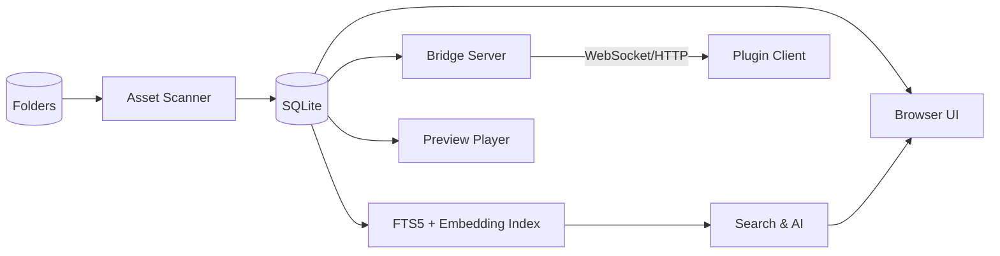

# USAM — Universal Sound Asset Manager
## Architecture of an All-in-One Music Creation Platform

> **One product, four pillars.** USAM is a modular music-creation platform that combines a
> professional synthesizer (Serum 2 / Omnisphere 2 class), a deep sample player
> (Native Instruments Kontakt class), a loop-flipping sampler (Serato Sample class), and the
> universal sound-asset library manager that ties them all together.

---

## Table of Contents

1. [Vision & Product Definition](#1-vision--product-definition)
2. [Design Targets — Reference Products](#2-design-targets-reference-products)
3. [System Architecture Overview](#3-system-architecture-overview)
4. [Repository Layout](#4-repository-layout)
5. [Shared Foundations](#5-shared-foundations)
6. [Native Audio Engine (JUCE)](#6-native-audio-engine-juce)
7. [DSP Foundation](#7-dsp-foundation)
8. [Synthesis Engine](#8-synthesis-engine)
9. [Sampler Engine (Sample Player)](#9-sampler-engine-sample-player)
10. [Loop Sampler & Slicer](#10-loop-sampler--slicer)
11. [Effects & Mixing Architecture](#11-effects--mixing-architecture)
12. [Patch, Instrument & Library Formats](#12-patch-instrument--library-formats)
13. [Preset & Asset Database (SQLite)](#13-preset--asset-database-sqlite)
14. [Desktop Manager Application](#14-desktop-manager-application)
15. [Plugin ⇄ Manager Bridge](#15-plugin--manager-bridge)
16. [MIDI & Host Integration](#16-midi--host-integration)
17. [Threading & Real-Time Safety](#17-threading--real-time-safety)
18. [Performance Budgets](#18-performance-budgets)
19. [GUI Architecture](#19-gui-architecture)
20. [State, Undo/Redo & Automation](#20-state-undoredo--automation)
21. [Testing Strategy](#21-testing-strategy)
22. [Build, Packaging & Distribution](#22-build-packaging--distribution)
23. [Licensing & Legal](#23-licensing--legal)
24. [Roadmap & Milestones](#24-roadmap--milestones)
25. [Risks & Open Questions](#25-risks--open-questions)

---

## 1. Vision & Product Definition

### 1.1 Mission

USAM (Universal Sound Asset Manager) is an **all-in-one music creation platform**. It unifies
every stage of the production workflow into a single, database-driven ecosystem:

| Pillar | Product class | Reference products |
|---|---|---|
| **Synthesizer** | Professional polyphonic hybrid synth | Serum 2, Omnisphere 2 |
| **Sample Player** | Multi-sampled instrument player | Native Instruments Kontakt |
| **Sampler** | Loop chopping / beat-making sampler | Serato Sample |
| **Library Manager** | Universal sound-asset database & browser | Native Access, Komplete Kontrol, Basehead |

The core insight: **one database, one browser, one patch format, one engine**. Any sound asset —
a wavetable, a multi-sampled piano, a sliced break — is *content* that flows through the same
library, the same engine, and the same format.

### 1.2 Guiding Principles

- **One platform, two surfaces.** A native audio plugin (the *Engine*, JUCE/C++) does the
  sound; a desktop application (the *Manager*, Electron/React/TypeScript) does the library.
  Both read from and write to the same shared SQLite database.
- **Unified content model.** Synthesizer patches, multi-sampled instruments, sliced loops, and
  raw samples are all assets with a common metadata schema.
- **Real-time first.** The audio core is allocation-free, lock-free, and deterministic.
- **Modular engines.** Synthesis, sampling, playback, and slicing are separate engines that can
  be loaded into a single instance (multi-part patches) or standalone.
- **Professional DSP quality.** 64-bit internal processing where needed, anti-aliased
  oscillators, high-quality time-stretching, and analog-modeled saturation.
- **Database-driven.** SQLite is the single source of truth for the library; FTS5 powers
  full-text and AI-assisted search.

---

## 2. Design Targets — Reference Products

The engine is engineered against concrete, measurable targets derived from the market leaders.

### 2.1 Synthesizer (Serum 2 / Omnisphere 2 class)

| Area | Target |
|---|---|
| Oscillators per voice | 2 × wavetable/sample/multisample/granular/spectral + 1 sub + noise |
| Wavetable editor | 2048-sample frames, up to 256 frames per table, draw + import + resynthesis |
| Oscillator modulation | FM, PM, ring mod, phase distortion, sync, warps per oscillator |
| Filters | 40+ algorithms in 7 categories (LP/HP/BP/Notch, analog emulations, state-variable, vocal/formant, comb, peaking, waveshaper) |
| Envelopes | 12 per patch (ADSR to multi-breakpoint, velocity/chaos/curve control) |
| LFOs | 8 per patch + 2 per-voice, tempo sync, custom shapes, chaos/random modes |
| Modulation matrix | 64 assignable slots — any source → any destination, bipolar/unipolar, curves |
| Unison | 1–16 voices per oscillator, spread + detune + phase offset, per-oscillator |
| Granular | Dedicated granular engine (grain size, density, position, scatter) |
| Spectral | Real-time harmonic resynthesis of imported audio |
| Arpeggiator/Sequencer | Step sequencer + arpeggiator with groove, latch, MIDI capture |

### 2.2 Sample Player (Kontakt class)

| Area | Target |
|---|---|
| Hierarchy | Instruments → Groups → Zones (same mental model as Kontakt) |
| Keymapping | Drag/drop zones, key ranges, root keys, crossfades between key/velocity regions |
| Velocity layers | Unlimited layers, crossfades, linear/log response curves |
| Round-robin | Multi-group RR cycling (2–8 alternates) to kill the "machine gun" effect |
| Time-stretch | Licensed high-quality engine (zplane élastique class) — independent pitch & tempo |
| Disk streaming | Multi-gigabyte libraries streamed from disk with RAM cache + lookahead |
| Scripting | Sandboxed Lua-based **USL (USAM Scripting Language)** for custom logic & GUIs |
| Articulations | Keyswitches, sustain/pizz/muted switching via groups |
| Multi outputs | Per-group/per-instrument output routing, 16+ stereo/mono outs |

### 2.3 Sampler (Serato Sample class)

| Area | Target |
|---|---|
| Slicing | Auto-slice by transient/beat detection, even bars, manual markers, 32 pads |
| Beatgrid | Auto BPM/key detection, beatgrid editing, quantized triggering |
| Pitch/Time | Independent pitch and time via the same licensed engine as §2.2 |
| Stems | On-device (local) stem separation: drums, bass, vocals, other |
| Pads | 32 velocity-sensitive pads with reverse, one-shot/loop, choke groups |
| Keyboard mode | Map a slice chromatically across the keyboard |

### 2.4 Library Manager (Native Access / Komplete Kontrol class)

| Area | Target |
|---|---|
| Asset types | Plugins, samples, presets, instruments, libraries (Kontakt/Falcon/HALion), wavetables |
| Search | SQLite FTS5 full-text + filter facets (type, vendor, category, tags) + AI-assisted natural-language search |
| Tagging | User-defined tags, many-to-many, favorites, smart collections |
| Scanning | Recursive folder scan with session tracking, dedupe, hash-based change detection |
| Management | Install/remove/uninstall, library registration, license/activation status |

---

## 3. System Architecture Overview

USAM has **two runtimes that share one database**:



**Key architectural rule:** the audio (real-time) thread **never** touches the database or the
file system. All library access from the plugin happens on the UI thread (or via an async
bridge), with data marshalled into the real-time thread through lock-free queues.

### 3.1 Layers

| Layer | Surface | Tech | Responsibility |
|---|---|---|---|
| Presentation | Engine GUI + Manager GUI | JUCE UI / React | Editing, browsing, visualization |
| Application | Engine controllers + Manager services | C++ / TypeScript | Use cases, workflows, bridge |
| Domain | Engines (synth, sampler, slicer) | C++ | Sound generation & playback |
| DSP | `dsp/` namespace | C++ (SIMD) | Oscillators, filters, FX, time-stretch |
| Persistence | SQLite + Asset Store | SQLite / filesystem | Metadata, tags, FTS, binary content |

---

## 4. Repository Layout

The project is a monorepo combining the existing TypeScript manager with the new native engine.

```
usam/
├── audio/                        # JUCE C++ audio engine (new)
│   ├── CMakeLists.txt
│   ├── src/
│   │   ├── core/                 # plugin entry, processor, audio graph, voice manager
│   │   ├── dsp/                  # oscillators, filters, envelopes, lfos, fx, resamplers
│   │   ├── engines/              # synth / sampler / slicer engines
│   │   ├── midi/                 # MIDI parsing, MPE, learn, hardware profiles
│   │   ├── script/               # USL (Lua) sandbox runtime
│   │   ├── presets/              # patch & instrument (de)serialization
│   │   ├── gui/                  # plugin GUI components & resources
│   │   └── bridge/               # IPC bridge client (shared memory + named pipes)
│   └── tests/                    # DSP unit tests, engine tests, conformance tests
├── manager/                      # Electron/React/TS manager (existing)
│   ├── src/
│   │   ├── main/                 # Electron main process
│   │   ├── preload/              # preload scripts
│   │   ├── renderer/             # React UI
│   │   └── services/             # db, plugin, search, tag services
│   └── tests/
├── shared/                       # shared contracts between surfaces (existing)
│   ├── constants/
│   ├── interfaces/
│   └── types/
├── database/
│   ├── schema.sql                # SQLite schema (existing, extended)
│   └── migrations/
├── docs/                         # architecture, formats, scripting reference
├── scripts/                      # dev & release tooling (existing)
└── package.json
```

---

## 5. Shared Foundations

### 5.1 Contract Packages (`shared/`)

The two surfaces communicate through versioned TypeScript interfaces compiled into a shared
contract, mirrored on the C++ side as a generated header:

- **Asset model** — `Asset`, `AssetType`, `Vendor`, `Tag`, `ScanSession`
- **Patch model** — the unified patch/instrument schema (§12)
- **Bridge protocol** — request/response envelope, events, streaming chunk protocol
- **UI contracts** — search queries, facet definitions, library browser state

### 5.2 Database (SQLite)

SQLite is embedded in the manager (better-sqlite3, existing) and opened read-only by the
engine bridge. See [§13](#13-preset--asset-database-sqlite) for the full data model.

### 5.3 Build Versions

A single version constant (`SHARED_API_VERSION`) guards compatibility between manager and
engine; mismatched versions negotiate a handshake and refuse unsafe operations.

---

## 6. Native Audio Engine (JUCE)

### 6.1 Overview

The Engine is a JUCE-based audio plugin targeting **VST3, AU, and AAX**, built with **CMake**
(JUCE's recommended modern build system). It is a single plugin binary that hosts all engines.

### 6.2 Plugin Structure

- **`USAMAudioProcessor`** — JUCE processor; owns the `AudioGraph`, `VoiceManager`,
  `ParameterManager` (APVTS), and the `EngineRouter`.
- **`USAMEditor`** — JUCE editor; hosts the GUI (§19), bridges UI actions to parameters.
- **`EngineRouter`** — selects and combines engines per MIDI channel / part (see multi-part
  patches in §12.4).

### 6.3 Audio Processing Model

- Block-based, **host-driven buffer sizes** (32–8192 samples). Internally the processor
  sub-blocks at ≤64 samples so parameter smoothing, envelopes, and LFO updates run at fine
  granularity regardless of host block size.
- 64-bit float accumulation for mixing; 32-bit float for DSP where sufficient (SIMD).
- Internal sample rate stays locked to the host; engines render at oversampling factors
  1×/2×/4×/8× with polyphase decimation (see §18).

### 6.4 Processing Pipeline (per voice)

```mermaid
flowchart LR
    MIDI[MIDI In] --> VM[Voice Manager]
    VM --> OSC1[Osc 1: WT/Sample/Granular/Spectral]
    VM --> OSC2[Osc 2: WT/Sample/Granular/Spectral]
    VM --> SUB[Sub] --> NM[Noise]
    OSC1 --> ROUTE[Osc Routing / FM / Ring]
    OSC2 --> ROUTE
    ROUTE --> FILTER1[Filter 1]
    FILTER1 --> FILTER2[Filter 2 (series/parallel)]
    SUB --> FILTER1
    NM --> FILTER1
    MOD[Modulation Matrix<br/>LFOs/ENVs/CC/velocity] --> FILTER1
    MOD --> OSC1
    MOD --> OSC2
    FILTER2 --> AMP[Voice Amp Env]
    AMP --> PAN[Pan / Stereo Spread]
    PAN --> FXSEND[Voice FX Sends]
```

### 6.5 Voice Model

- **Synth voices:** 32–128 configurable (default 64).
- **Sampler voices:** up to 1000+ via disk streaming; not CPU-bound by synthesis.
- Voice states: `Idle → Triggered → Playing → Released → Idle`, plus `Sustaining` and
  `Sleeping` (voice stealing candidates).
- Voice stealing: priority (oldest-released first, then quietest, then oldest), with optional
  "steal nearest semitone" behavior for chords.
- `VoicePool` pre-allocates all voice state in `prepareToPlay`; no heap allocation on the
  audio thread.

---

## 7. DSP Foundation

The `dsp/` namespace is a self-contained, allocation-free, testable DSP library.

### 7.1 Core Primitives

| Module | Contents |
|---|---|
| `osc/` | Anti-aliased band-limited oscillators (BLEP/BLIT), wavetable osc (2048×256 frames, linear/cubic interpolation), sub-osc, noise (white/pink, `xorshift` + filters) |
| `wt/` | Wavetable engine — frame morphing, index smoothing, warps (FM, PW/PD, ring, distortion), import & resynthesis to table |
| `filter/` | SVF (LP/HP/BP/NOTCH), Moog ladder, Oberheim/Jupiter-style, comb, formant/vowel, peaking, allpass, state-variable with nonlinear saturation |
| `env/` | ADSR, multi-breakpoint (up to 8 segments), loop, curve shaping, velocity tracking |
| `lfo/` | Sine/tri/saw/square/S&H/random/custom-drawn, rate 0.01–100 Hz, tempo-synced divisions, phase/offset, one-shot mode |
| `mod/` | Modulation bus: linear ramps, smoothing (`OnePole`, `SlewLimiter`), curve mappers, 16×16 matrix engine |
| `fx/` | Reverb (algorithmic + convolution), delay (analog/digital/modulated), chorus/flanger/phaser, distortion/saturation (tube/transistor/diode models), compressor/limiter/transient, EQ (parametric shelves), stereo widener |
| `time/` | Time-stretch & pitch-shift (licensed engine wrapper), resamplers (polyphase, half-band), beat detection, transient detection |
| `simd/` | `SIMDHelpers` — SSE/AVX/NEON-accelerated mix/add/multiply, FIR, biquad batches |

### 7.2 Real-Time Safety Rules

1. **No allocation** on the audio thread — all buffers/state pre-allocated.
2. **No locks** — parameter updates arrive via lock-free SPSC queues or atomics.
3. **No I/O** — file access, database access, and network are UI/worker-thread only.
4. **Determinism** — the same MIDI + parameter stream always produces bit-identical output
   (required for golden-file testing, §21).

---

## 8. Synthesis Engine

The synthesis engine is the Serum 2 / Omnisphere 2 class heart of USAM.

### 8.1 Sound Sources (per voice)

Each of the two main oscillators can be any of five source types:

> **External audio input** (post-M0, optional): audio-rate external input routed into the
> mod matrix, filters, or a vocoder-style carrier — a flagship-class feature listed as an
> open scope item rather than a v1 commitment.

1. **Wavetable** — 2048-sample frames × up to 256 frames; morphing, warps, and a built-in
   wavetable editor (draw, additive, import → resynthesis).
2. **Multisample** — plays back instrument samples (`.wav/.aiff/.flac/.ogg`), with loop
   points, root note, and optional per-zone mapping (bridges to the sampler engine's zone
   system).
3. **Sample oscillator** — loop slicing, tape-stop, tails mode, real-time warp.
4. **Granular** — grain size/density/position/scatter; sample- or table-based.
5. **Spectral** — real-time harmonic resynthesis with independent time/frequency bending.

Cross-modulation: OSC1 → OSC2 (FM/PM), ring mod, phase distortion, and **sync**.

### 8.2 Unison

- 1–16 voices per oscillator, spread (0–100 cents), detune, stereo width, phase
  randomization, and per-voice amplitude envelope shaping. Implemented as cheap shared state
  (phase offsets + detune tables) rather than duplicated synthesis paths.

### 8.3 Filters

- Two filter slots, **series or parallel**, each hosting any of the 40+ algorithms across
  seven categories: Classic LP/HP/BP/Notch, analog emulations (Moog/Jupiter/Oberheim),
  State Variable, Vocal/Formant, Comb, Peaking, and Waveshapers.
- Continuous cutoff/resonance modulation with key-tracking; drive + circuit saturation per
  filter.

### 8.4 Envelopes (12 per patch)

- Each envelope: ADSR or up to 8-segment multi-breakpoint, exponential/linear curves,
  loop mode, velocity scaling, time scaling by key, chaos amount, and "retrig on note".

### 8.5 LFOs (8 per patch + 2 per voice)

- Rate as Hz or tempo division; shapes incl. custom-drawn; sync, phase, delay, fade-in;
  polyphonic (per-voice) triggering where musically appropriate (vibrato) vs global for
  patch-level movement (filter sweep).

### 8.6 Modulation Matrix

- **64 assignable slots; any source → any destination** (replacing the earlier 8×8/16×16
  ambiguity with one definitive, flexible spec).
- Sources: 8 global LFOs, 2 per-voice LFOs, 12 envelopes, velocity, key, aftertouch,
  pitch-bend, 8 MIDI CCs, random, noise, audio-rate mods, MPE X/Y, external inputs.
- Destinations: all oscillator params, filter cutoff/res/Q, amp, pan, FX params, wavetable
  position, granular params, unison spread, etc.
- Per-slot: amount (±), bipolar/unipolar, custom curve, scaling, depth modulation.

### 8.7 Arpeggiator & Sequencer

- Step sequencer (up to 32 steps) + arpeggiator with patterns, latch, groove/swing,
  step-dividers (ratcheting), velocity per step, and **MIDI capture** (drag generated
  sequence into the DAW as MIDI).

---

## 9. Sampler Engine (Sample Player)

The sampler engine is the Kontakt-class sample player: multi-sampled instrument playback.

### 9.1 Hierarchy

```
Instrument (.usami)                  ← one playable patch
├── Groups                           ← articulations / RR pools / shared FX
│   ├── Group 1 (e.g. "sustain")     ← keyswitch or velocity-split
│   │   ├── Zones                    ← key + velocity ranges referencing samples
│   │   │   ├── Zone (sample file, root, loop points, tune/gain)
│   │   │   └── Zone (crossfade ranges)
│   └── Group 2 (e.g. "pizzicato")
└── Outputs / FX / Mod routing
```

### 9.2 Mapping Editor

- Zones: drag/drop sample → key range, root key, velocity range, crossfades (key & velocity),
  per-zone pitch, gain, loop (off/fwd/alt/ping-pong), release trigger, choke groups.
- Auto-mapping: split samples across keyboard by name patterns (C1.wav, D#2.wav...).
- RR (round-robin): zones assigned to RR groups 1–8, cycle order configurable.

### 9.3 Playback Engine

- **Disk streaming**: 64–256 KB chunks read ahead via a dedicated streaming thread;
  RAM cache LRU; lookahead buffer hides disk latency; polyphony up to 1000+ voices.
- **Time-stretch**: licensed engine (zplane élastique class) for independent pitch/time,
  tempo-sync of loops, and tempo-synced instruments.
- Per-voice: amp/pan env, filters (from §7), LFOs, pitch tracking, key-tracking, per-group FX.

### 9.4 USL — USAM Scripting Language

- **Lua 5.4** sandboxed runtime (safe libraries only, memory + instruction limits).
- Scriptable: custom UIs, chord/arpeggio generators, legato/portamento logic, RR control,
  keyswitch management, MIDI processing, on-note/on-release/on-controller callbacks.
- API mirrors the engine's public C++ interfaces via a generated binding layer.
- **No scripts on the audio thread** — callbacks are marshalled; DSP-visible changes are
  applied through the lock-free parameter queue.

### 9.5 Multi-Outputs

- 16+ stereo / 32 mono output buses; per-group and per-zone output routing; each output
  host-routable in VST3/AU/AAX.

---

## 10. Loop Sampler & Slicer

The loop sampler is the Serato Sample class surface: instant beat-making from audio.

### 10.1 Loading & Analysis

- Drag-and-drop any audio (`.wav .aiff .flac .ogg .mp3 .m4a`).
- **Beat detection**: onset/transient detection → automatic slice points.
- **Slicing modes**: `Find Samples` (best hit points), `Set Slicer` (even bars/beats),
  manual markers, randomize.
- **Beatgrid**: auto BPM & key detection, grid editing, quantized trigger, warping to host
  tempo.
- **Stems** (local, on-device): source-separated drums/bass/vocals/other using an
  on-device model (no cloud upload).

### 10.2 Playback & Pads

- 32 pads (velocity-sensitive), each: one-shot/loop mode, reverse, choke groups, per-pad
  pitch/slice offset, attack/release, filter, gain, and **per-pad output routing**.
- **Keyboard mode**: current slice mapped chromatically across the keyboard.
- Pitch/time via the same licensed engine (§9.3) — a professional, transparent algorithm
  (transient preservation, polyphonic material support).

---

## 11. Effects & Mixing Architecture

### 11.1 Effect Racks

- **Insert rack** per voice/group (sampler) and per-part (synth): freely reorderable chain
  of 60+ units.
- **Send/return buses** (e.g. shared reverb/delay per instrument).
- **Master chain**: EQ, compressor, limiter, stereo tools.
- Effects categories: dynamics, EQ, modulation, time (delay/reverb), distortion/saturation,
  filter, utility, and **convolution** (IR loading for reverbs & cabinets).

### 11.2 Mixing

- Each part/instrument renders to its own bus → master.
- Per-bus: volume, pan, mute/solo, FX sends, output routing.
- 64-bit summing for headroom; final dithering only at plugin output stage.

---

## 12. Patch, Instrument & Library Formats

### 12.1 Unified Format

One family of formats built on a common container (ZIP with a JSON manifest + binary sections):

| Extension | Content |
|---|---|
| `.usamp` | Synthesizer patch (osc/filter/env/lfo/mod/FX/arp state) |
| `.usami` | Sampler instrument (groups/zones/mapping/script/FX) |
| `.usamx` | Multi-part performance (one or more .usamp/.usami on MIDI channels/splits) |
| `.usaml` | Packaged library (assets + metadata + artwork + license manifest) |

### 12.2 Patch Serialization

- JSON manifest (parameter IDs, values, mod matrix, routing) + optional binary sections
  (wavetables, sample references, IRs).
- **Versioned**: every patch carries a format version and a `writtenBy` app version; the
  loader migrates older versions forward (§12.5).
- Presets reference samples/wavetables by **library-relative paths**, not absolute paths
  (portability + the "no hardcoded paths" rule).

### 12.3 Sample & Library Storage

- Assets are stored once in the **Asset Store** (a managed folder, default
  `~/USAM/Library`), referenced by content hash to avoid duplicates.
- Libraries (.usaml) are read-only, signed, and registered in the DB with vendor/version info.

### 12.4 Multi-Part Patches

- `.usamx` stacks up to 8 parts (synth + sampler + slicer mix), each on a MIDI channel or
  key split — enabling hybrid patches like "synth pad over sampled piano over sliced break".

### 12.5 Migration

- Schema migrations in `database/migrations/`; patch migrations in the loader; both
  forward-only with a rollback for failed migrations.

---

## 13. Preset & Asset Database (SQLite)

### 13.1 Core Tables (extends existing `database/schema.sql`)

| Table | Purpose |
|---|---|
| `assets` | All assets: `id`, `type` (plugin/sample/preset/instrument/library/wavetable), `name`, `vendor`, `category`, `path_hash`, `content_hash`, `size`, `created_at`, `updated_at` |
| `asset_metadata` | EAV-style extended metadata (key/value per asset) |
| `tags` + `asset_tag` | Many-to-many tagging (existing, extended) |
| `scan_sessions` | Scan runs, status, stats (existing) |
| `plugins` | VST plugin records (existing) |
| `libraries` | Registered .usaml libraries + license/activation state |
| `presets` | Patch/instrument index (name, tags, favorite, last-used) |
| `collections` | Smart collections (saved filter queries) |
| `search_index` | FTS5 virtual table over name, vendor, category, tags, description |
| `embedding_cache` | Vector cache for AI-assisted search |

### 13.2 Full-Text & AI Search

- **FTS5** for instant substring/token search over assembled search documents
  (name + vendor + category + tags + description).
- **AI-assisted search** via a provider abstraction (local embedding model + optional cloud):
  natural-language queries → vector similarity over `embedding_cache`, with FTS5 as the fast
  fallback. No audio-thread involvement — search runs in the manager or engine UI thread.

### 13.3 Concurrency

- Manager opens the DB read-write (WAL mode). Engine bridge opens it read-only.
- WAL allows concurrent readers without blocking the writer; the engine never writes.

### 13.4 Backup, Integrity & Recovery

- Scheduled backups of the library DB + manifest of the Asset Store (daily + on-demand).
- Integrity checks on open: `PRAGMA integrity_check`, WAL checkpoint, and content-hash
  verification for registered libraries; corrupted entries are quarantined, not deleted.
- Recovery path: restore from the last good backup; migrations are forward-only (§12.5) so
  restores are version-safe.
- Idempotent rescan: hashes let the scanner re-derive the library from the Asset Store
  without data loss.

---

## 14. Desktop Manager Application

The Manager is the existing Electron/React/TypeScript app, extended to cover the new content
types and to act as the bridge host.

### 14.1 Manager Data Flow



### 14.2 Responsibilities

- **Scanning**: recursive folder scans with hash-based change detection; scheduled scans.
- **Browsing**: unified asset browser with facets (type/vendor/category/tags), smart
  collections, preview player.
- **Tagging**: create/edit/delete tags, bulk tag, favorites.
- **Search**: FTS5 + AI-assisted (§13.2).
- **Library registration**: install/remove .usaml libraries; vendor/version/license state.
- **Bridge host**: spawns/keeps alive the bridge server the plugin connects to (§15).
- **Content tools**: wavetable import, sample analysis, patch/instrument import/export.

### 14.3 Architecture (existing, extended)

```
manager/src/
├── main/          # Electron main: windows, DB, services, bridge server
├── preload/       # contextIsolation-safe API surface for the renderer
├── renderer/      # React UI (PluginBrowser, SearchBar, TagList, new: LibraryBrowser, PreviewPlayer, ContentTools)
└── services/      # db, plugin, search, tag, scan, library, bridge services
```

---

## 15. Plugin ⇄ Manager Bridge

The bridge lets the plugin use the manager's library without embedding SQLite or the indexer
in real-time code.

### 15.1 Transport

- **Localhost WebSocket + HTTP** (loopback only), authenticated with a per-user token.
- The manager is the **server**; the engine is the **client** (the plugin connects when loaded).
- If the manager isn't running, the plugin works standalone (direct sample/table loading
  from the asset store with a cached index snapshot).

### 15.2 Protocol (versioned)

| Request | Purpose |
|---|---|
| `library.browse` | Faceted query against `assets`/`search_index` |
| `library.search` | FTS5 + AI search |
| `library.tags` | List/tag assets |
| `library.patch` | Fetch a `.usamp/.usami/.usamx` + referenced assets |
| `library.preview` | Request the manager's preview player render a sample |
| `engine.state` | Manager asks engine for current patch (e.g., to save from the library) |
| `events` | Subscribe: library changed, scans finished, licenses updated |

### 15.3 Caching

- The engine maintains a read-only snapshot cache (asset index + metadata) refreshed on
  `events`; browsing stays responsive offline and never blocks audio.

---

## 16. MIDI & Host Integration

### 16.1 MIDI 1.0 + MPE

- Full note on/off, poly aftertouch, channel pressure, CC, program change, pitch bend,
  SysEx.
- **MPE** (MIDI Polyphonic Expression): per-note pitch/CC74 timbre/CC1 dynamics on a
  receiver channel, configurable zones.
- Tempo sync from host transport (LFOs, arp, delay times, loop sync).

### 16.2 MIDI Learn & Hardware Profiles

- MIDI learn on any parameter (per-part and global); profile save/load.
- **Hardware profiles** (Omnisphere-class): curated CC maps for popular controllers
  (Komplete Kontrol, Arturia, Novation...), plus a generic template editor.

### 16.3 Automation

- All engine parameters are exposed for host automation via APVTS (continuous IDs, ranges,
  steps, unit names). Parameter smoothing prevents zipper noise (§20).

---

## 17. Threading & Real-Time Safety

### 17.1 Thread Model

| Thread | Work |
|---|---|
| **Audio thread** (real-time) | DSP, voices, FX. No allocation/locks/I/O. |
| **GUI thread** (UI) | Plugin & manager UI, parameter edits (→ lock-free queue), bridge I/O. |
| **Streaming thread** | Disk read-ahead for sampler; delivers samples via ring buffer. |
| **Worker pool** | Wavetable import/resynthesis, analysis (beat/BPM/key), stem separation, AI embedding. |
| **Bridge server** | Manager process: serves library queries; spawns worker tasks. |

### 17.2 Synchronization Primitives

- Lock-free SPSC queues for: MIDI in → audio, parameter updates → audio, script callbacks →
  audio, bridge state → audio.
- Atomics for voice allocation counters and CPU metering.
- The only `std::mutex` in the engine lives on non-real-time paths (init, teardown).

### 17.3 Realtime-Safety Review Gate

Every change touching the audio thread goes through a checklist: allocations? locks? I/O?
non-determinism? Tested with `-fsanitize` and a custom heap tracker in debug builds.

### 17.4 Fault Containment, Logging & Crash Reporting

- **Fault containment**: USL script crashes kill only the script VM (restartable), never the
  audio thread; DSP asserts fail soft in release (bypass unit, report once) to avoid audio
  dropouts.
- **Logging**: ring-buffer logger on the audio thread (no I/O) that is drained asynchronously;
  structured logs (UI/manager side) with levels and correlation IDs.
- **Crash reporting**: opt-in minidump collection for the plugin and manager, scrubbed of
  personal data, uploaded via the manager; crash context includes patch hash, engine version,
  and host info — never sample content.

---

## 18. Performance Budgets

Targets at reference config **48 kHz, 128-sample host buffer**, measured on a mid-range
consumer laptop (single core):

| Scenario | Budget |
|---|---|
| 64-voice synth patch (2 WT osc + 2 filters + 3 env) | ≤ 15% CPU |
| Unison-heavy patch (128 notes × 4× unison) | ≤ 45% CPU *(assumes sub-linear unison scaling via shared state + phase offsets; linear extrapolation would be ~120%)* |
| Sampler, 500 streaming voices | ≤ 8% CPU (+disk I/O) |
| Time-stretch 4× on one voice | ≤ 20% CPU |
| Preset load (large .usami) | < 100 ms |
| Plugin cold start to first sound | < 2 s |
| GUI redraw at 60 fps with 64 voices | no audio dropouts |

### 18.1 Optimization Strategy

1. Correct scalar reference → profile → SIMD hotspots (osc, filters, FX).
2. Oversampling only where aliasing matters (oscillators, saturation); 2× default, up to 8×
   with polyphase decimation. Ratio switching mid-stream is flagged as an implementation
   detail (latency/phase implications across the polyphase chain); the goal is no audible
   glitches via short crossfades.
3. Voice pooling, zero-copy voice buses, cache-friendly voice interleaving.
4. Streaming tuned with adaptive lookahead vs. available RAM.

---

## 19. GUI Architecture

### 19.1 Plugin GUI (JUCE)

- **Tabs/panels**: Oscillators, Wavetable editor, Filters, Envelopes, LFOs, Mod Matrix,
  Arp/Sequencer, FX Rack, Sampler (Mapping/Group/Zone), Slicer (Pads), Mixer, Browser,
  Settings.
- **Visual feedback**: waveform displays, modulation animation, analyzer (spectrum/scope),
  level meters, CPU meter.
- **Drag & drop**: file → oscillator/slicer/mapping editor; mod routing by dragging source →
  destination; FX reordering.
- **Design principles**: resizable with DPI scaling, customizable themes, GPU-accelerated
  canvas (JUCE OpenGL), keyboard shortcuts, DAW-like consistent look.
- Touch-friendly controls with proper hit targets.

### 19.2 Manager GUI (React)

- Asset browser (list/grid), facet filters, search bar, tag editor, preview player,
  library management views, scanning status, AI search panel.
- Styling per existing `ui/src/styles/global.css` conventions; responsive layout.

### 19.3 Accessibility & Localization

- **Accessibility**: full keyboard navigation, focus order, ARIA roles in the React UI, and
  JUCE's accessibility API surface (screen-reader labels, focus traversal) in the plugin.
  Color-contrast-compliant themes; no control relies on color alone.
- **Localization (i18n)**: all user-facing strings live in resource bundles (React i18n +
  JUCE `BinaryData` string tables); UI ships English first, with a translation pipeline.
  Locale-independent number/unit formatting.

---

## 20. State, Undo/Redo & Automation

### 20.1 Parameter Management (APVTS)

- 128+ continuous and stepped parameters per part, tree-organized; smoothing
  (configurable time constants); automation support; MIDI mapping (§16.2).
- Parameter changes are enqueued lock-free and applied at the next sub-block boundary.

### 20.2 Undo/Redo

- Command-pattern undo stack (configurable depth) over parameter edits and structural edits
  (zone moves, FX order, script edits). Nested/grouped commands. Undo/redo runs on the UI
  thread; audio state converges via the parameter queue.

### 20.3 State Serialization

- Plugin state (host recall) = full `.usamx` snapshot. Delta-based autosave for the manager.

---

## 21. Testing Strategy

| Layer | Approach |
|---|---|
| DSP units | Deterministic golden-file tests (bit-exact), sweep/reference tests vs. analytic curves |
| Engines | Integration tests: MIDI in → rendered audio out; voice-stealing scenarios; unison correctness; disk-streaming under latency injection |
| Sampler | Zone/RR/keymap behavior tests; time-stretch accuracy (pitch ± cents); loop artifacts |
| Scripting | USL sandbox security tests, API conformance, instruction-limit enforcement |
| Patch format | Round-trip (save→load→bit-compare), migration tests for every old version |
| Bridge | Protocol conformance, version handshake, offline fallback |
| GUI | JUCE unit tests + screenshot diffs; React component tests (Vitest) |
| Performance | Automated benchmark suite tracking the §18 budgets in CI |
| Hosts | Launch in live hosts (Reaper/Logic/FL) — manual + automated smoke via plugin test hosts |
| Real-time safety | Sanitizers, heap tracker, deterministic replay |

---

## 22. Build, Packaging & Distribution

### 22.1 Build System

- **CMake** for the engine; existing npm/Vite scripts for the manager; one top-level
  orchestrating script.
- CI (GitHub Actions): matrix (Windows/macOS/Linux × Debug/Release), unit + integration +
  benchmark gates.
- Automated installers: Windows (NSIS), macOS (notarized .pkg/.dmg), Linux (.deb/.AppImage).

### 22.2 Distribution

- Engine: VST3/AU/AAX binaries + installer.
- Manager: Electron packages (electron-builder, existing).
- Library packs: signed .usaml files distributed separately (paid/free content).

---

## 23. Licensing & Legal

| Item | Decision |
|---|---|
| JUCE | Licensing **changed with JUCE 8** (Jan 2025): free tier is GPLv3-compliant or subject to new revenue-cap/restriction terms; a commercial "JUCE 8" license applies above thresholds or for closed source. **Verify current terms before committing** — decision gates the business model |
| AAX | Requires **Avid Developer SDK agreement** + certification |
| Time-stretch engine | Commercial license (e.g., zplane élastique) — proprietary; license terms must be checked against GPL distribution |
| Stem separation model | On-device model; licensing depends on chosen model & weights |
| Sample content | Content creators sign standard sample-license agreements; .usaml manifest records license terms |
| Scripting runtime | Lua is MIT-licensed — fine for both GPL and commercial |

---

## 24. Roadmap & Milestones

| Phase | Scope | Exit criteria |
|---|---|---|
| **M0 — Foundation** | CMake/JUCE scaffold, plugin loads in a DAW, APVTS, voice manager, 1 wavetable osc + SVF + ADSR, basic patch save/load | Patch round-trips; 1 osc plays in a host |
| **M1 — Synth core** | 2 osc + sub/noise, unison, filters (7 categories), 12 env, 8 LFO, 16×16 matrix, arp, FX rack, plugin GUI v1 | §8 spec largely met; §18 synth budgets met |
| **M2 — Sampler engine** | Zones/groups/instruments, mapping editor, RR, velocity layers, streaming, USL runtime, .usami format | Kontakt-class instrument loads & plays; 500-voice streaming budget met |
| **M3 — Slicer** | Beat/transient detection, pads, keyboard mode, pitch/time, beatgrid, stems (local) | Serato-class slicing workflow in host |
| **M4 — Manager & bridge** | Extend Electron app (new asset types, preview, content tools), bridge server, engine client, FTS5 + AI search | Library browse/tag/search works from inside the plugin |
| **M5 — Polish & release** | Multi-part patches, hardware profiles, MPE, packaging, installers, store readiness | v1.0 ships for VST3/AU/AAX + manager installers |

(Aligned with the existing `ROADMAP.md` MVP/Beta/Release story: M0–M3 extend the platform
beyond MVP asset management into content creation; M4/M5 close the loop.)

---

## 25. Risks & Open Questions

| Risk | Mitigation |
|---|---|
| Scope explosion ("everything at once") | Strict milestone gates; engines built on one shared DSP core |
| JUCE GPL vs commercial licensing | Decide business model early; keep DSP core license-clean |
| Time-stretch engine cost | Evaluate élastique vs alternatives before M2 |
| Disk streaming complexity | Prototype streaming in M2 with latency injection tests |
| AAX certification cost/time | Ship VST3/AU first; AAX later under agreement |
| Stem separation accuracy/perf | On-device model; fall back to classic slicing when model unavailable |
| GUI scope | Tier the GUI: functional (M1) → polished (M5); reuse one component kit |
| Bridge security | Loopback-only + token auth; plugin falls back gracefully offline |

**Open questions** (decide during M0/M4):
1. Business model: GPL open-source core + paid libraries, vs. commercial plugin?
2. Which time-stretch vendor (élastique vs. competitors)?
3. Which on-device stem model (size/quality/CPU trade-off)?
4. NKS-style hardware/controller partnerships, or in-house hardware profiles only?

---

*USAM: every sound you need, one platform, one library, one engine.*
